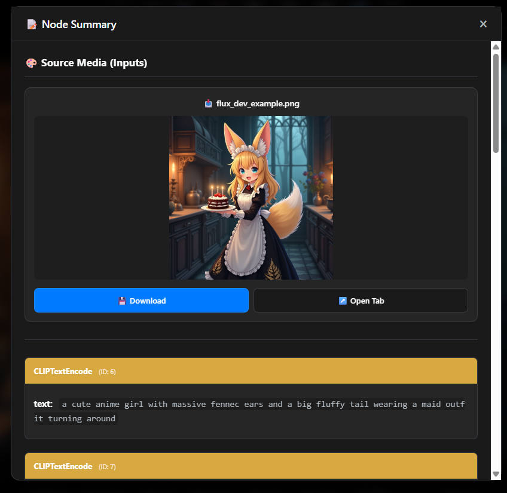
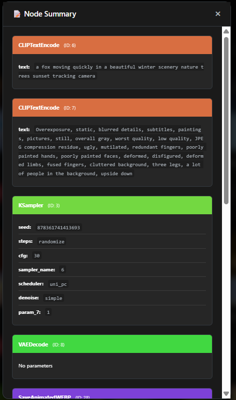
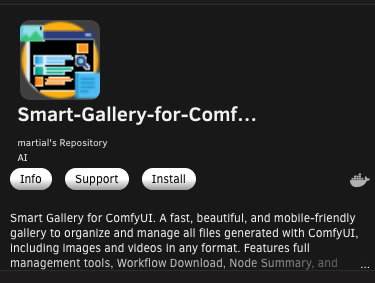

# SmartGallery for ComfyUI ✨
### Your Visual Hub with Universal Workflow Recall, Upload Magic & Intelligent Organization

## 🎯 Every ComfyUI User's Dream: Complete Browser-Based Control

Your output gallery is overflowing with generations.<br>You need to **organize them on the fly**—even when ComfyUI isn't running.<br> You want to click once and instantly see which workflow created that stunning image or video, with a visual node summary showing even the source images you started from.<br>When you launch multiple generations, you want immediate web gallery updates.<br>You need to delete files, move them between folders, create new ones—all from your browser.<br>Filter by extension, prefix, or name, and download workflows as JSON.

**Whether you're a tech beginner or an advanced user, experience all of this from your PC browser or smartphone—seamlessly on Windows, Linux, or Docker.**<br>Perfect mobile visualization included. ✨

---
<p align="center">
  
</p>

<p align="center">
  
</p>

<p align="center">
  <em>🎨 Beautiful, lightning-fast gallery that remembers the exact workflow behind every single creation</em>
</p>

<p align="center">
  
  
</p>

<p align="center">
  <em>🔍 Instant workflow insights - Node Summary</em>
</p>

<p align="center">
  <a href="LICENSE"></a>
  
  <a href="https://github.com/biagiomaf/smart-comfyui-gallery/stargazers"></a>
</p>

---

## ✨ What Makes SmartGallery Revolutionary

SmartGallery isn't just another image viewer. It's a **time machine for your creativity** that automatically links every single file you've ever generated to its exact workflow—whether it's PNG, JPG, MP4, or WebP.

### ⚡ Key Features That Will Transform Your Workflow

- 🏃‍♂️ **Blazing Fast**: SQLite database + smart caching = instant loading even with thousands of files
- 📱 **Mobile Perfect**: Gorgeous interface that works flawlessly on any device
- 🔍 **Node Summary Magic**: See model, seed, and key parameters at a glance (supports UI & API formats)
- 🎨 **Source Media in Node Summary**: View input images, videos, and listen to audio files directly inside the Node Summary. Automatically shows media files referenced in your workflow nodes from the ComfyUI input directory.
- 📁 **Smart Organization**: Expandable sidebar with real-time search, bi-directional sorting (name/date), and intuitive folder management
- 🖼️ **Enhanced Gallery View**: Sort thumbnails by date or name with instant toggle between ascending/descending order
- 🔎 **Advanced Lightbox**: Zoom with mouse wheel, numpad panning, persistent zoom levels, and quick delete functionality
- 📦 **Batch Operations**: Select multiple files and download as ZIP, or use range selection for bulk actions
- 🆕 **Universal Upload Magic**: Upload ANY ComfyUI-generated image/video from your PC or phone and instantly discover its workflow!
- 🌍 **Community Sharing**: Someone shared an amazing creation? Upload it and see exactly how they made it!
- 🔄 **Real-time Sync**: Silent background checks with visual progress overlay when new files are detected
- 🚨 **Smart Diagnostics**: Visual alerts for configuration issues and missing dependencies
- ⌨️ **Keyboard Shortcuts**: Full keyboard navigation with built-in help (press `?`)
- 🔄 **Auto-Update Check**: Stay informed about new versions automatically
- 🔧 **Standalone Power**: Works independently—manage your gallery even when ComfyUI is off
- ⚡ **Lightning Setup**: Simple configuration with environment variables or direct file editing
- 🐳 **Docker Ready**: Full containerization support for advanced deployment scenarios


## 🆕 What's New in Version 1.41?

- 🎨 **Source Media in Node Summary**: View input images, videos, and listen to audio files directly inside the Node Summary. Automatically shows media files referenced in your workflow nodes from the ComfyUI input directory
- 📦 **Batch Zip Download**: Select multiple files and download them as a single archive with background generation
- 🐳 **Full Docker Support**: Run in an isolated container with easy deployment (Credits: Martial Michel)
- 🔢 **Smart File Counter**: Instantly see how many files are currently filtered versus the total folder count
- 📱 **Mobile Optimization**: Improved UI layout, padding, and controls specifically for mobile devices
- 🔧 **Environment Variables**: Configure everything via OS variables for easier deployment
- 🗑️ **Safe Delete Option (Optional)**: By default, files are permanently deleted. Configure the variable `DELETE_TO` to move them to a specific folder (like `/tmp` or Trash) instead.
- 🚨 **Startup Diagnostics**: Beautiful console output and visual alerts for configuration errors
- 🎮 **Advanced Controls**: Range selection (`↔️`), Numpad panning, and a visual shortcuts bar (press `?`)
- 🔄 **Automatic Update Check**: Get notified when a new version is available
- 📋 **Enhanced Node Summary**: Now supports both ComfyUI UI and API format JSONs
- ↔️ **Range Selection**: Select all files between two selections with one click
- ⌨️ **Keyboard Shortcuts Help**: Press `?` to see all available shortcuts
- 🎮 **Advanced Lightbox Controls**: Numpad panning, adjustable pan speed, and visual shortcut bar

See [CHANGELOG.md](CHANGELOG.md) for detailed version history.

<div align="center">
  
  
</div>
<p align="center">
  <em>📱 Perfect mobile experience</em>
</p>

---

## 🎮 Installation: Ridiculously Simple

### Step 1: Get the Code
```bash
git clone https://github.com/biagiomaf/smart-comfyui-gallery
cd smart-comfyui-gallery
```

### Step 2: Quick Setup
```bash
# Create virtual environment (recommended)
python -m venv venv

# Activate it
# Windows Command Prompt: call venv\Scripts\activate.bat
# Mac/Linux: source venv/bin/activate

# Install dependencies
pip install -r requirements.txt
```

### Step 3: Configure Your Paths

You have **two easy options** to configure SmartGallery:

#### 🅰️ Option A: Environment Variables (recommended)

Perfect if you want to keep your settings separate or run multiple configurations.

**Windows (Command Prompt):**
```cmd
call venv\Scripts\activate.bat
set "BASE_OUTPUT_PATH=C:/ComfyUI/output"
set "BASE_INPUT_PATH=C:/ComfyUI/input"
set "FFPROBE_MANUAL_PATH=C:/ffmpeg/bin/ffprobe.exe"
set SERVER_PORT=8189
REM Leave MAX_PARALLEL_WORKERS empty to use all CPU cores (recommended)
set "MAX_PARALLEL_WORKERS="
python smartgallery.py
```

**Linux/Mac:**
```bash
source venv/bin/activate
export BASE_OUTPUT_PATH="$HOME/ComfyUI/output"
export BASE_INPUT_PATH="$HOME/ComfyUI/input"
export FFPROBE_MANUAL_PATH="/usr/bin/ffprobe"
export SERVER_PORT=8189
# Leave MAX_PARALLEL_WORKERS empty to use all CPU cores (recommended)
export MAX_PARALLEL_WORKERS=""
python smartgallery.py
```

> 💡 **Tip**: See the complete configuration guide at the top of `smartgallery.py` for all available settings and detailed examples!

#### 🅱️ Option B: Direct File Edit 

Open `smartgallery.py` and find the **USER CONFIGURATION** section. A detailed guide is included at the top of the file. Update just the paths after the commas:
```python
# Find this section and change ONLY the values after the commas:
BASE_OUTPUT_PATH = os.environ.get('BASE_OUTPUT_PATH', 'C:/ComfyUI/output')
BASE_INPUT_PATH = os.environ.get('BASE_INPUT_PATH', 'C:/ComfyUI/input')
FFPROBE_MANUAL_PATH = os.environ.get('FFPROBE_MANUAL_PATH', "C:/ffmpeg/bin/ffprobe.exe")
SERVER_PORT = int(os.environ.get('SERVER_PORT', 8189))
```

> 💡 **Important**: Always use forward slashes (`/`) even on Windows! If your paths contain spaces, use quotes.

> 📹 **FFmpeg Note**: Recommended for extracting workflows from MP4 files. Download from [ffmpeg.org](https://ffmpeg.org/) if needed. Common locations:
> - Windows: `C:/ffmpeg/bin/ffprobe.exe` or `C:/Program Files/ffmpeg/bin/ffprobe.exe`
> - Linux: `/usr/bin/ffprobe` or `/usr/local/bin/ffprobe`
> - Mac: `/usr/local/bin/ffprobe` or `/opt/homebrew/bin/ffprobe`

### Step 4: Launch & Enjoy
```bash
python smartgallery.py
```

Visit **`http://127.0.0.1:8189/galleryout`** and watch the magic happen!

> **⏱️ First Run**: The initial launch scans your files and generates thumbnails. Thanks to parallel processing, this is now incredibly fast (seconds to a few minutes depending on your collection size). After that? Lightning fast! ⚡

---


## 🐳 Docker Deployment (Advanced Users)

Want to run SmartGallery in a containerized environment? We've got you covered!

> 🎖️ **Special Thanks**: A huge shout-out to **[Martial Michel](https://github.com/mmartial)** for orchestrating the Docker support and contributing significant improvements to the core application logic.

> **Note for Windows Users**: The standard installation (Steps 1-4 above) is much simpler and works perfectly on Windows! Docker is completely optional and mainly useful for Linux servers or advanced deployment scenarios.

Docker deployment provides isolation, easier deployment, and consistent environments across different systems. However, it requires some familiarity with Docker concepts.

**🗄️ Pre-built images**

Pre-built images are available on DockerHub at [mmartial/smart-comfyui-gallery](https://hub.docker.com/r/mmartial/smart-comfyui-gallery) and Unraid's Community Apps. 



Example `docker run` command:

```bash
# Adapt the mounts and WANTED_UID/WANTED_GID variables to match your system
docker run \
  --name smartgallery \
  -v /comfyui-nvidia/basedir/output:/mnt/output \
  -v /comfyui-nvidia/basedir/input:/mnt/input \
  -v /comfyui-nvidia/SmartGallery:/mnt/SmartGallery \
  -e BASE_OUTPUT_PATH=/mnt/output \
  -e BASE_INPUT_PATH=/mnt/input \
  -e BASE_SMARTGALLERY_PATH=/mnt/SmartGallery \
  -p 8189:8189 \
  -e WANTED_UID=`id -u` \
  -e WANTED_GID=`id -g` \
  mmartial/smart-comfyui-gallery
```

> **Note**: The `id -u` and `id -g` commands return the user and group IDs of the current user, respectively. This ensures that the container runs with the same permissions as the host user, which is important for file permissions and access to mounted volumes.

A [compose.yaml](compose.yaml) file is provided for ease of use. You can use it to obtain the published image and run the container with the following command after placing it in a directory of your choice and adapting the paths and environment variables to match your system:
```bash
docker compose up -d
```

See the following section's "All available environment variables" for a list of all available environment variables.

**📚 [Complete Docker Setup Guide →](DOCKER_HELP.md)**

Our comprehensive Docker guide covers:
- 🏗️ Building the Docker image
- 🚀 Running with Docker Compose (recommended for beginners)
- ⚙️ Using Makefile (For advanced control and automation)
- 🔐 Understanding permissions and volume mapping
- 🛠️ Troubleshooting common Docker issues
- 📋 All available environment variables


---

## Environment Variables Reference

All settings are configured via environment variables with fallback defaults in the code.

### Paths & Core Settings

| Variable | Description | Default |
|---|---|---|
| `BASE_OUTPUT_PATH` | Main media/assets folder (required) | `/app/data/output` |
| `BASE_INPUT_PATH` | Source media input folder | `/app/data/input` |
| `BASE_SMARTGALLERY_PATH` | Location for cache/database files | Same as `BASE_OUTPUT_PATH` |
| `SERVER_PORT` | Web server port | `8189` (Railway sets `PORT` automatically) |
| `FFPROBE_MANUAL_PATH` | Path to ffprobe executable | `/usr/bin/ffprobe` |
| `FFMPEG_MANUAL_PATH` | Path to ffmpeg executable | `/usr/bin/ffmpeg` |
| `MAX_PARALLEL_WORKERS` | CPU cores for parallel processing | Empty = all cores |
| `DELETE_TO` | Trash folder path (empty = permanent delete) | Empty |
| `SECRET_KEY` | Flask secret key for session signing | Auto-generated |
| `THUMBNAIL_WIDTH` | Width in pixels for generated thumbnails | `300` |
| `PAGE_SIZE` | Number of files per gallery page | `100` |
| `BATCH_SIZE` | Files per batch during scanning | `500` |

### Social Media Integration

Set `SOCIAL_FEATURES_ENABLED=true` (default) to enable the social posting module.

| Variable | Description | Required |
|---|---|---|
| `FB_APP_ID` | Meta (Facebook/Instagram) OAuth App ID | For Facebook/Instagram |
| `FB_APP_SECRET` | Meta (Facebook/Instagram) OAuth App Secret | For Facebook/Instagram |
| `LINKEDIN_CLIENT_ID` | LinkedIn OAuth Client ID | For LinkedIn |
| `LINKEDIN_CLIENT_SECRET` | LinkedIn OAuth Client Secret | For LinkedIn |

Facebook and Instagram use the same Meta app. The OAuth flow automatically discovers Instagram Business accounts linked to your Facebook Pages.

### SharePoint Integration

Connect a SharePoint Online document library as a gallery asset source.

| Variable | Description | Default |
|---|---|---|
| `SHAREPOINT_TENANT_ID` | Azure AD tenant ID | Required |
| `SHAREPOINT_CLIENT_ID` | Azure AD app registration client ID | Required |
| `SHAREPOINT_CLIENT_SECRET` | Azure AD app registration client secret | Required |
| `SHAREPOINT_SITE_URL` | SharePoint site URL (e.g., `https://contoso.sharepoint.com/sites/marketing`) | Required |
| `SHAREPOINT_LIBRARY_NAME` | Document library name to sync | `Documents` |
| `SHAREPOINT_SYNC_INTERVAL` | Seconds between background syncs | `300` (5 min) |
| `SHAREPOINT_LOCAL_CACHE_DIR` | Local directory for cached SharePoint files | `{BASE_SMARTGALLERY_PATH}/.sharepoint_cache` |

**How SharePoint sync works:** A background thread periodically downloads media files (images, videos, audio) from the configured SharePoint document library to a local cache directory. The folder structure from SharePoint is preserved. Files are only re-downloaded when their size changes. Once cached locally, they appear in the gallery sidebar as a browsable folder and are searchable/viewable like any other gallery content.

**Setup overview:**
1. Register an app in Azure AD (portal.azure.com > App registrations)
2. Grant it `Sites.Read.All` application permission on Microsoft Graph
3. Get admin consent for the permission
4. Set the 4 required environment variables above
5. Use the "Test Connection" button in Settings to verify

### Maintenance & Cleanup

Automatic cleanup runs periodically to prevent disk space issues from cache growth.

| Variable | Description | Default |
|---|---|---|
| `STARTUP_MAINTENANCE` | Run intensive cleanup on startup (for system recovery) | `false` |
| `AGGRESSIVE_CLEANUP` | Use shorter retention periods for cleanup | `false` |
| `MAINTENANCE_INTERVAL_HOURS` | Hours between scheduled maintenance runs | `6` |
| `ZIP_RETENTION_HOURS` | Hours to keep ZIP download cache files | `24` |
| `SMASHCUT_RETENTION_HOURS` | Hours to keep smashcut output files | `168` (7 days) |
| `STORAGE_WARNING_THRESHOLD` | Disk usage % to trigger warning status | `80` |
| `STORAGE_CRITICAL_THRESHOLD` | Disk usage % to trigger critical alert | `90` |
| `STORAGE_EMERGENCY_THRESHOLD` | Disk usage % to trigger auto-cleanup | `95` |

**Compression Settings:**

| Variable | Description | Default |
|---|---|---|
| `THUMBNAIL_FORMAT` | Thumbnail format: `webp` (smaller) or `jpeg` (faster) | `webp` |
| `THUMBNAIL_QUALITY` | Thumbnail quality 1-100 (lower = smaller files) | `70` (webp) / `80` (jpeg) |
| `ZIP_COMPRESSION_LEVEL` | ZIP compression level 0-9 (higher = smaller but slower) | `6` |

**What gets cleaned:**
- **ZIP cache**: Temporary batch download files (`.zip_downloads/`)
- **Smashcut output**: Generated video files (`.smashcut_output/`)
- **Orphaned thumbnails**: Thumbnails for deleted/moved files (`.thumbnails_cache/`)
- **SharePoint cache**: Files no longer tracked in database (`.sharepoint_cache/`)
- **Database**: WAL checkpoint and VACUUM for space reclamation

**Manual maintenance:** Admins can trigger cleanup via API:
- `GET /galleryout/social/maintenance/status` - View cache disk usage
- `POST /galleryout/social/maintenance/run` - Run cleanup (add `?aggressive=true` for intensive cleanup)

**Recovery from disk full:** Set `STARTUP_MAINTENANCE=true` to run aggressive cleanup on next restart.

---
## Reverse Proxy Setup

Running behind Nginx or Apache? Point your proxy to:
```
http://127.0.0.1:8189/galleryout
```

**Example Nginx configuration:**
```nginx
location /gallery/ {
    proxy_pass http://127.0.0.1:8189/galleryout/;
    proxy_set_header Host $host;
    proxy_set_header X-Real-IP $remote_addr;
    proxy_set_header X-Forwarded-For $proxy_add_x_forwarded_for;
}
```

---

## 🤝 Join the Community

### Found a Bug? Have an Idea?
**[➡️ Open an Issue](../../issues)** - I read every single one!

### Want to Contribute?
1. Fork the repo
2. Create your feature branch (`git checkout -b amazing-feature`)
3. Commit your changes (`git commit -m 'Add amazing feature'`)
4. Push to the branch (`git push origin amazing-feature`)
5. Open a Pull Request

Let's build something incredible together! 🚀

---

## 📚 Troubleshooting

### Gallery won't start?
- **Check Python version**: `python --version` (needs 3.9+)
- **Verify paths**: Use forward slashes (`/`) even on Windows, and quotes if paths contain spaces
- **Check startup alerts**: SmartGallery now shows visual diagnostics for common issues
- **Ensure folder exists**: The ComfyUI output folder must exist and be accessible

### Thumbnails not generating?
- **For MP4 files**: Install FFmpeg and set `FFPROBE_MANUAL_PATH` correctly (you'll see a startup alert if missing)
- **Check permissions**: Folder must be readable and writable
- **Memory issues?**: Try reducing `MAX_PARALLEL_WORKERS` to limit CPU usage (e.g., set to 4)

### Port already in use?
- Change `SERVER_PORT` to a different number (e.g., 8190, 8191)
- Make sure it's different from ComfyUI's port (usually 8188)


**Still stuck?** [Open an issue](../../issues) with details about your setup and any error messages from the startup diagnostics!

---

## 🔥 License

SmartGallery is released under the **MIT License** - see [LICENSE](LICENSE) for details.

This software is provided "as is" without warranty. Use responsibly and in compliance with applicable laws.

---

## ❤️ Show Some Love

If SmartGallery has transformed your ComfyUI workflow, **please give it a ⭐ star!** 

It takes 2 seconds but means the world to me and helps other creators discover this tool.

**[⭐ Star this repo now!](https://github.com/biagiomaf/smart-comfyui-gallery/stargazers)**

---

## 📋 Changelog

See [CHANGELOG.md](CHANGELOG.md) for detailed version history.

---

<p align="center">
  <em>Made with ❤️ for the ComfyUI community</em>
</p>
